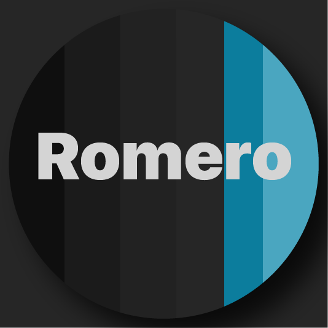

# My Custom Theme

This is a custom theme for Visual Studio Code, designed with a focus on readability and comfort for long coding sessions.

## Features

* A dark color scheme that's easy on the eyes.
* Syntax highlighting for a wide range of programming languages.

## Installation

1. Open the Extensions sidebar in VS Code. `View → Extensions`
2. Search for 'My Custom Theme', and install it.
3. After installation, select `Code → Preferences → Color Theme → Romero Dark Theme`.

## Feedback

If you have suggestions or issues, please open an issue on the [GitHub repository](https://github.com/yousefturin/romero-dark).

**Enjoy coding with My Custom Theme!**
